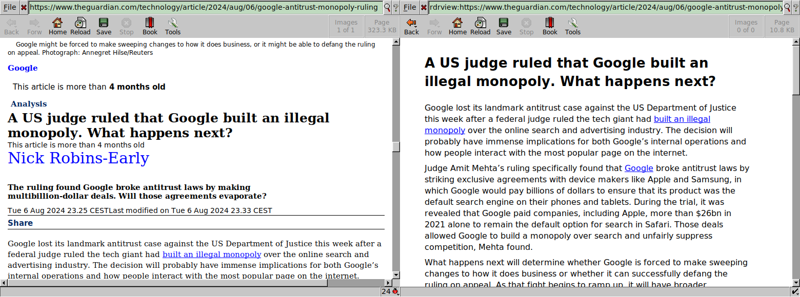

# Rdrview plugin for Dillo

[Rdrview][] plugin for [Dillo][] written in Bash.



Requires curl and rdrview installed.

To install use:

```sh
make install
```

To enable the reader mode add `rdrview:` in front of the URL.

[Rdrview]: https://github.com/eafer/rdrview
[Dillo]: https://dillo-browser.github.io/

GPLv3 licensed.
